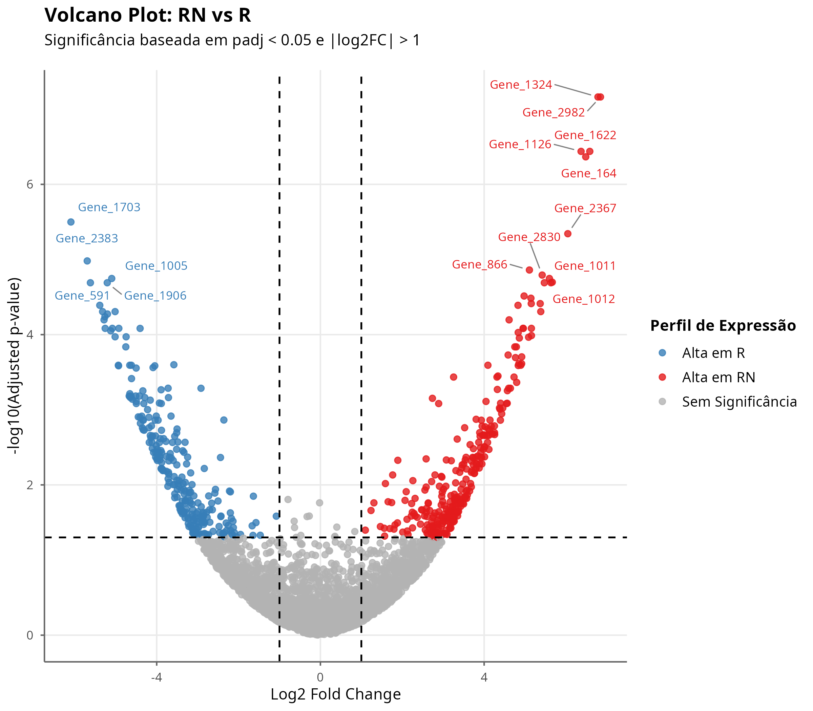
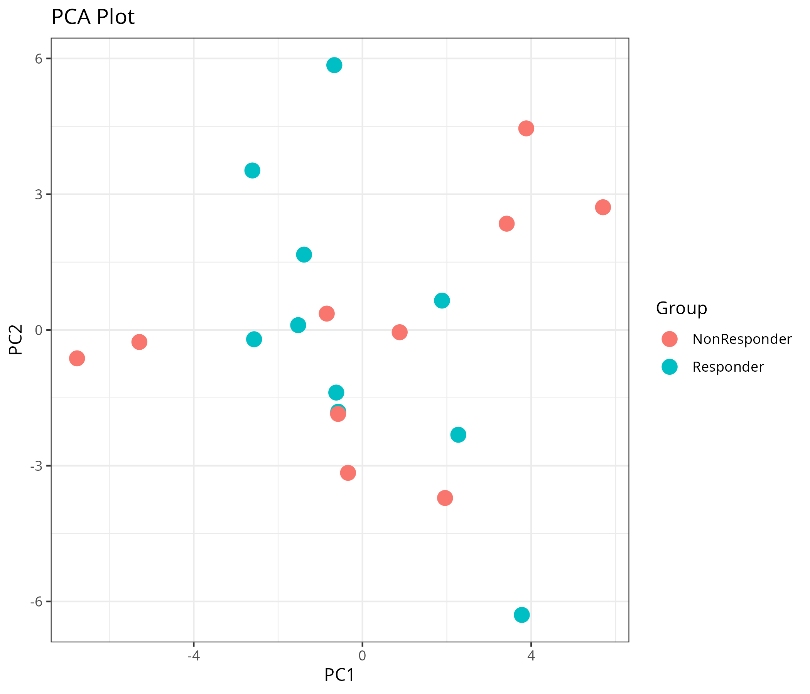
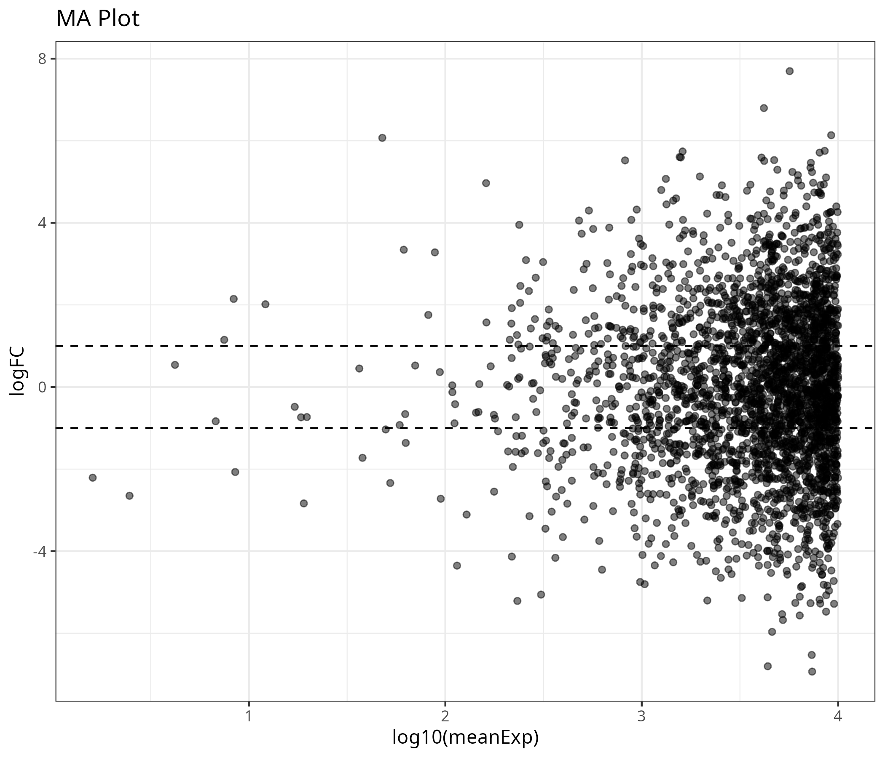
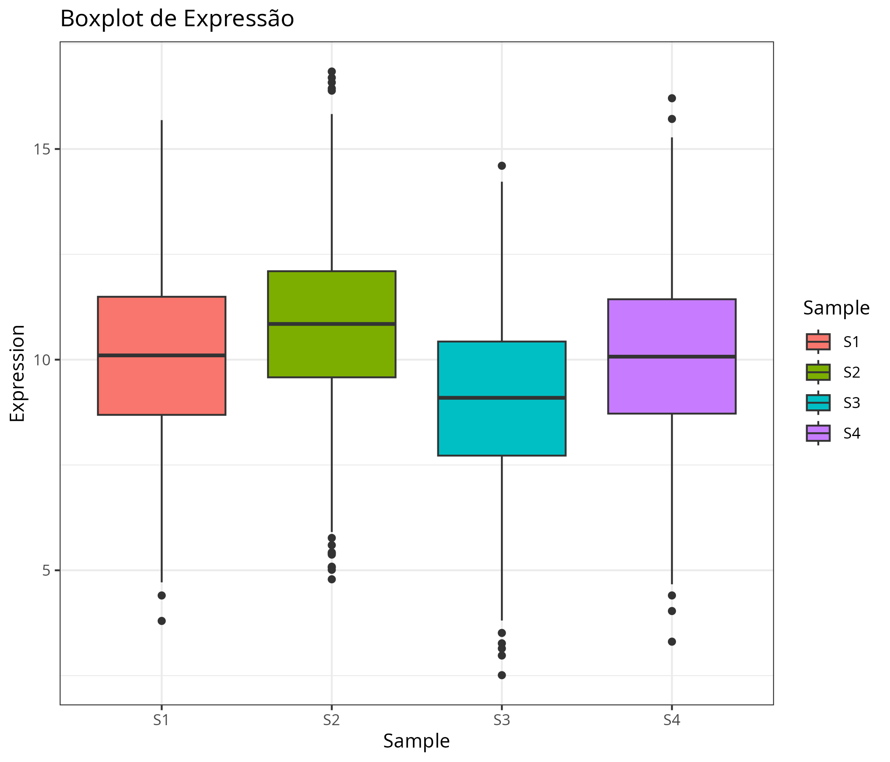
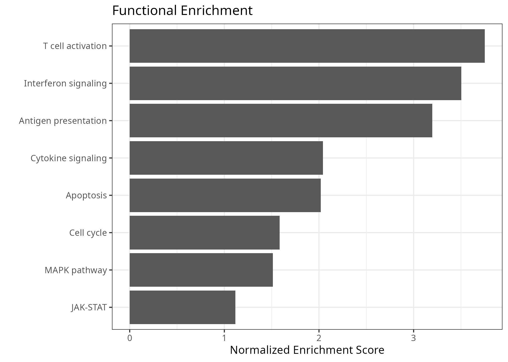
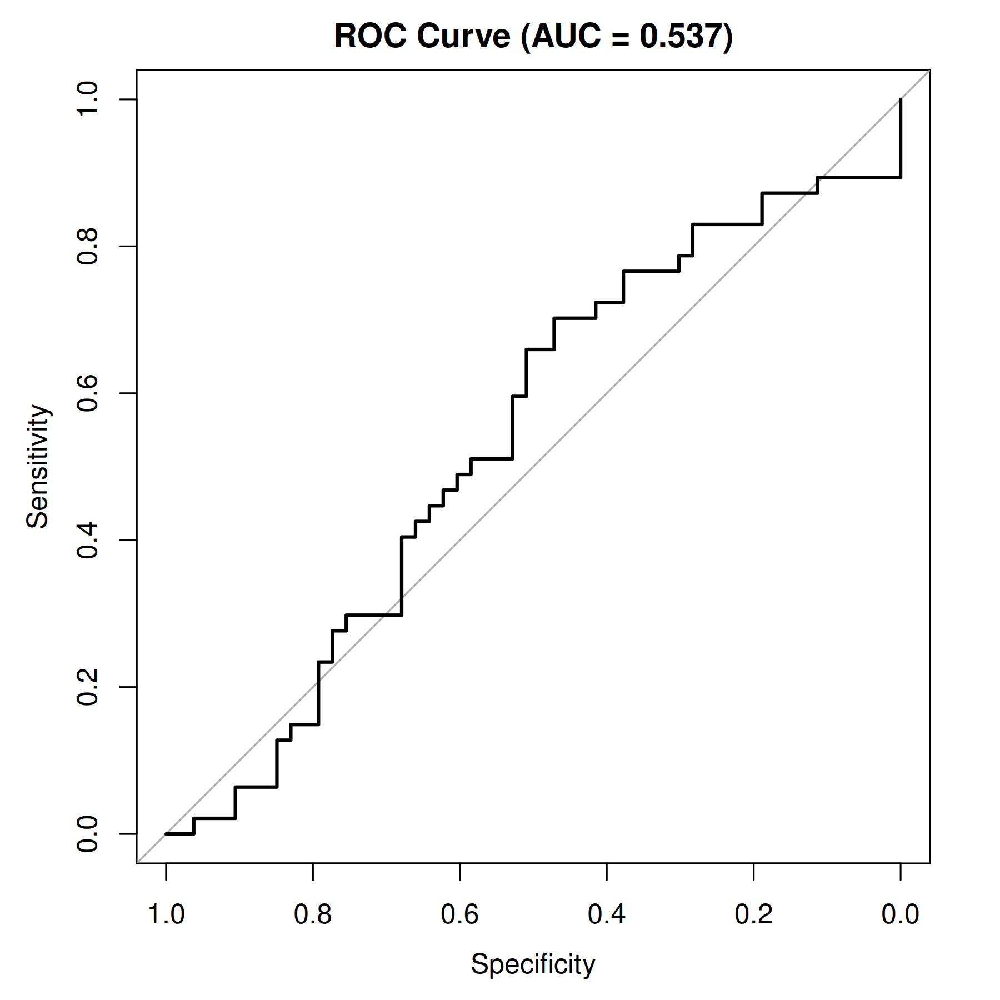
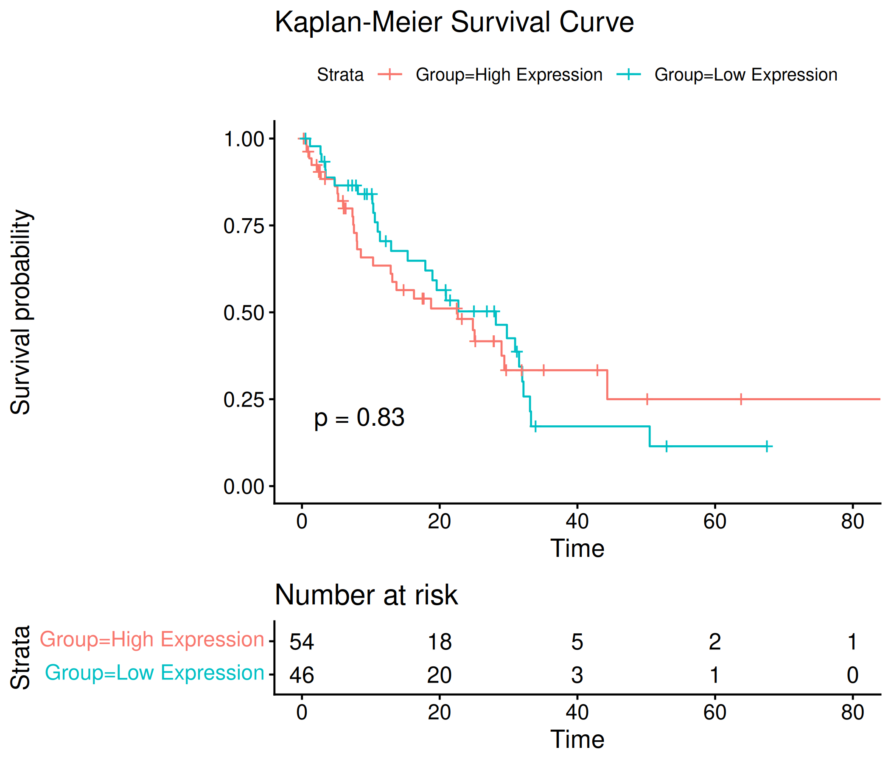

# Scripts em R para Gráficos de Bioinformática

Este arquivo contém o script em R para gerar diversos gráficos comuns em análises de bioinformática utilizando dados simulados. 

```R
###############################################################
# Gráficos em Bioinformática com Dados Fictícios
###############################################################

library(ggplot2)
library(pheatmap)
library(dplyr)
library(survival)
library(survminer)
library(pROC)
library(RColorBrewer)
library(ggrepel)

set.seed(123)

###############################################################
# 1. VOLCANO PLOT
###############################################################

n_genes <- 3000

# Gerando log2FC
log2FC <- rnorm(n_genes, 0, 2)

# CORREÇÃO: Criar p-valores condicionados ao log2FC 
# Genes com maior log2FC (positivo ou negativo) ganham p-valores muito menores (mais significativos)
base_pvalue <- runif(n_genes, 0, 1)
pvalue <- base_pvalue * exp(-abs(log2FC)^2 / 2) 

volcano <- data.frame(
  Gene = paste0("Gene_", 1:n_genes),
  log2FC = log2FC,
  pvalue = pvalue
)

volcano$padj <- p.adjust(volcano$pvalue, "BH")

# Classificação exata para a legenda bater perfeito com o anexo
volcano$Status <- "Sem Significância"
volcano$Status[volcano$log2FC > 1 & volcano$padj < 0.05] <- "Alta em RN"
volcano$Status[volcano$log2FC < -1 & volcano$padj < 0.05] <- "Alta em R"

# Selecionar os top genes mais significativos para colocar a etiqueta (label)
top_genes <- volcano %>%
  filter(Status != "Sem Significância") %>%
  arrange(padj) %>%
  head(15)

volcano$Label <- ifelse(volcano$Gene %in% top_genes$Gene, volcano$Gene, "")

# Gerando o gráfico com a distribuição correta e visual idêntico ao anexo
ggplot(volcano, aes(x = log2FC, y = -log10(padj), color = Status)) +
  geom_point(alpha = 0.8, size = 1.8) +
  
  # Linhas tracejadas de corte de significância
  geom_vline(xintercept = c(-1, 1), linetype = "dashed", color = "black", linewidth = 0.6) +
  geom_hline(yintercept = -log10(0.05), linetype = "dashed", color = "black", linewidth = 0.6) +
  
  # Nomes dos genes com linhas indicadoras (ggrepel)
  geom_text_repel(
    aes(label = Label),
    size = 3,
    max.overlaps = Inf,
    box.padding = 0.5,
    point.padding = 0.3,
    segment.color = "grey50",
    segment.size = 0.4,
    show.legend = FALSE
  ) +
  
  # Cores exatas do modelo solicitado
  scale_color_manual(values = c("Alta em RN" = "#E41A1C",       # Vermelho
                                "Alta em R" = "#377EB8",        # Azul
                                "Sem Significância" = "#B3B3B3")) + # Cinza
  
  # Textos e Títulos idênticos ao anexo
  labs(
    title = "Volcano Plot: RN vs R",
    subtitle = "Significância baseada em padj < 0.05 e |log2FC| > 1",
    x = "Log2 Fold Change",
    y = "-log10(Adjusted p-value)",
    color = "Perfil de Expressão"
  ) +
  
  # Ajuste do tema para eixos limpos (sem a caixa preta ao redor)
  theme_minimal() +
  theme(
    plot.title = element_text(face = "bold", size = 14, hjust = 0),
    plot.subtitle = element_text(size = 11, margin = margin(b = 15)),
    axis.title = element_text(size = 11),
    legend.title = element_text(face = "bold", size = 11),
    legend.text = element_text(size = 10),
    panel.grid.major = element_line(color = "#EAEAEA"),
    panel.grid.minor = element_blank(),
    axis.line = element_line(color = "#666666", linewidth = 0.5),
    axis.ticks = element_line(color = "#666666")
  )

# Salvando a figura em PNG com alta resolução
ggsave("1_volcano_plot.png", width = 8, height = 7, dpi = 300)
```
# 1. VOLCANO PLOT



```R
###############################################################
# 2. HEATMAP DE EXPRESSÃO GÊNICA
###############################################################
expr <- matrix(rnorm(100*20,10,2), nrow=100, ncol=20)
rownames(expr) <- paste0("Gene_",1:100)
colnames(expr) <- paste0("Sample_",1:20)
annotation <- data.frame(Group = rep(c("Responder","NonResponder"),each=10))
rownames(annotation) <- colnames(expr)

pheatmap(
  expr, scale="row", annotation_col = annotation, show_rownames = FALSE,
  main="Heatmap", filename="2_heatmap.png", width=7, height=7
)

```
# 2. HEATMAP DE EXPRESSÃO GÊNICA


```R
###############################################################
# 3. PCA PLOT
###############################################################
pca <- prcomp(t(expr),scale.=TRUE)
pca_df <- data.frame(PC1=pca$x[,1], PC2=pca$x[,2], Group=annotation$Group)

ggplot(pca_df,aes(PC1,PC2,color=Group))+
  geom_point(size=4)+ theme_bw()+ ggtitle("PCA Plot")
ggsave("3_pca_plot.png", width=7, height=6, dpi=300)

```
# 3. PCA PLOT


```R
###############################################################
# 4. MA PLOT
###############################################################
ma <- data.frame(meanExp = runif(n_genes,1,10000), logFC = rnorm(n_genes,0,2))
ggplot(ma,aes(log10(meanExp),logFC))+
  geom_point(alpha=0.5)+ geom_hline(yintercept=c(-1,1), linetype="dashed")+
  theme_bw()+ ggtitle("MA Plot")
ggsave("4_ma_plot.png", width=7, height=6, dpi=300)

```
# 4. MA PLOT


```R
###############################################################
# 5. BOXPLOT DE NORMALIZAÇÃO
###############################################################
box_data <- data.frame(
  Expression = c(rnorm(1000,10,2), rnorm(1000,11,2), rnorm(1000,9,2), rnorm(1000,10,2)),
  Sample = rep(c("S1","S2","S3","S4"), each=1000)
)
ggplot(box_data, aes(Sample,Expression,fill=Sample))+
  geom_boxplot()+ theme_bw()+ ggtitle("Boxplot de Expressão")
ggsave("5_boxplot_expressao.png", width=7, height=6, dpi=300)

```
# 5. BOXPLOT DE NORMALIZAÇÃO


```R
###############################################################
# 6. BARPLOT DE ENRIQUECIMENTO FUNCIONAL
###############################################################
go <- data.frame(
  Pathway=c("T cell activation", "Interferon signaling", "Antigen presentation", 
            "Cytokine signaling", "Apoptosis", "Cell cycle", "MAPK pathway", "JAK-STAT"),
  NES=sort(runif(8,1,4),decreasing = TRUE)
)
ggplot(go, aes(reorder(Pathway,NES),NES))+
  geom_bar(stat="identity")+ coord_flip()+ theme_bw()+
  ylab("Normalized Enrichment Score")+ xlab("")+ ggtitle("Functional Enrichment")
ggsave("6_functional_enrichment.png", width=7, height=5, dpi=300)

```
# 6. BARPLOT DE ENRIQUECIMENTO FUNCIONAL


```R
###############################################################
# 7. CURVA ROC
###############################################################
response <- sample(c(0,1),100,replace=TRUE)
prediction <- runif(100)
roc_obj <- roc(response,prediction)

png("7_roc_curve.png", width=1800, height=1800, res=300)
plot(roc_obj, main=paste0("ROC Curve (AUC = ", round(auc(roc_obj),3), ")"))
dev.off()

```
# 7. CURVA ROC


```R
###############################################################
# 8. CURVA DE SOBREVIVÊNCIA
###############################################################
surv_data <- data.frame(
  time = rexp(100,0.05), status = sample(c(0,1),100,replace=TRUE),
  Group = sample(c("High Expression", "Low Expression"), 100, replace=TRUE)
)
fit <- survfit(Surv(time,status)~Group, data=surv_data)
p_surv <- ggsurvplot(fit, data=surv_data, pval=TRUE, risk.table=TRUE, title="Kaplan-Meier Survival Curve")

png("8_survival_curve.png", width=2100, height=1800, res=300)
print(p_surv)
dev.off()

```
# 8. CURVA DE SOBREVIVÊNCIA


